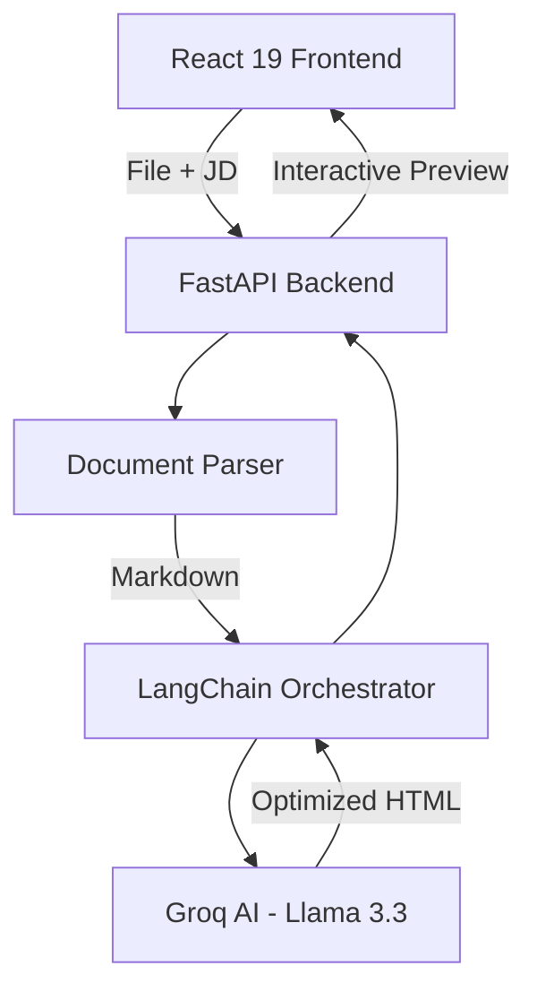

# TailorDoc: Your AI-Powered Career Architect 🚀

> **"Stop throwing your resume into the black hole. Start getting noticed."**

TailorDoc is an advanced, AI-driven platform designed to bridge the gap between your experience and your dream job. Using cutting-edge LLMs, it doesn't just "check" your resume—it **re-imagines** it for the specific role you want, ensuring you pass the ATS (Applicant Tracking System) and landed on the recruiter's desk.

---

## 🎭 For the Humans (Non-Techies)

### The Problem: The "Resume Black Hole"
You apply for a job. You're qualified. But you never hear back. Why? Most companies use **ATS software** that scans for specific keywords and formatting. If your resume doesn't match the Job Description (JD) perfectly, you're invisible.

### The Solution: Magic with Purpose
TailorDoc acts as your personal professional ghostwriter. 
1.  **Upload**: Give it your current resume (PDF/DOCX).
2.  **Input**: Paste the Job Description of your dream role.
3.  **Optimize**: Our AI analyzes what the company *really* wants and rewrites your bullet points to match, highlighting your relevant strengths while keeping your history honest.
4.  **Result**: You get a beautiful, clean, ATS-optimized PDF ready for upload.

---

## 💻 For the Builders (Developers)

TailorDoc is built with a modern, high-performance stack focusing on developer experience and speed.

### Architecture Overview


### Core Technologies
-   **Frontend**: React 19, Tailwind CSS v4 (the spearhead of utility-first CSS), TanStack Query for robust state management.
-   **Backend**: FastAPI (asynchronous, high-performance), LangChain for LLM flow orchestration.
-   **AI Engine**: Groq (Llama 3.3 70B) — providing near-instant inference for complex rewriting tasks.
-   **Parsing**: PyPDF2 and python-docx for seamless data extraction.

---

## 🛠️ Tech Stack & Features

-   **Smart Parsing**: Intelligent extraction from PDF and DOCX.
-   **AI Ghostwriting**: Dynamic bullet point generation using Llama 3.3 70B via Groq.
-   **ATS-Friendly Output**: Standardized, clean HTML/PDF structures that recruiters love.
-   **Premium UI**: Dark-mode, responsive interface crafted with Tailwind v4.
-   **Privacy-First**: Optional toggle to hide contact details for initial screenings.

---

## 🏁 Getting Started

### Prerequisites
-   **Node.js** (v18+)
-   **Python** (v3.10+)
-   **Groq API Key**: [Get it here](https://console.groq.com)

### Installation

1.  **Clone the Repository**
    ```bash
    git clone https://github.com/yourusername/TailorDoc.git
    cd TailorDoc
    ```

2.  **Backend Setup**
    ```bash
    cd backend
    python -m venv venv
    source venv/bin/activate  # Windows: venv\Scripts\activate
    pip install -r requirements.txt
    ```
    Create a `backend/.env` file:
    ```env
    GROQ_API_KEY=your_key_here
    GROQ_MODEL=llama-3.3-70b-versatile
    ```

3.  **Frontend Setup**
    ```bash
    cd ../frontend
    npm install
    ```

### Running the App
-   **Backend**: `uvicorn resume_backend.main:app --reload`
-   **Frontend**: `npm run dev`

---

## 📂 Project Structure

```text
TailorDoc/
├── backend/
│   ├── resume_backend/        # FastAPI core logic
│   │   ├── services/          # LLM Chain, Document Parser
│   │   └── routers/           # API endpoints
│   └── requirements.txt
└── frontend/
    ├── src/
    │   ├── components/       # UI Components
    │   ├── hooks/            # API interaction (TanStack Query)
    │   └── pages/            # Home and Result views
    └── package.json
```

---

## 🐛 Troubleshooting

-   **Scanning Issues**: If your PDF is purely an image, ensure you use a text-based version.
-   **API Limits**: Groq has generous free limits, but check your console if you hit 429 errors.
-   **Dependencies**: Ensure `Tailwind v4` is correctly handled by your IDE for highlighting.

---

## 📄 License
MIT License. Built with ❤️ for job seekers everywhere.
